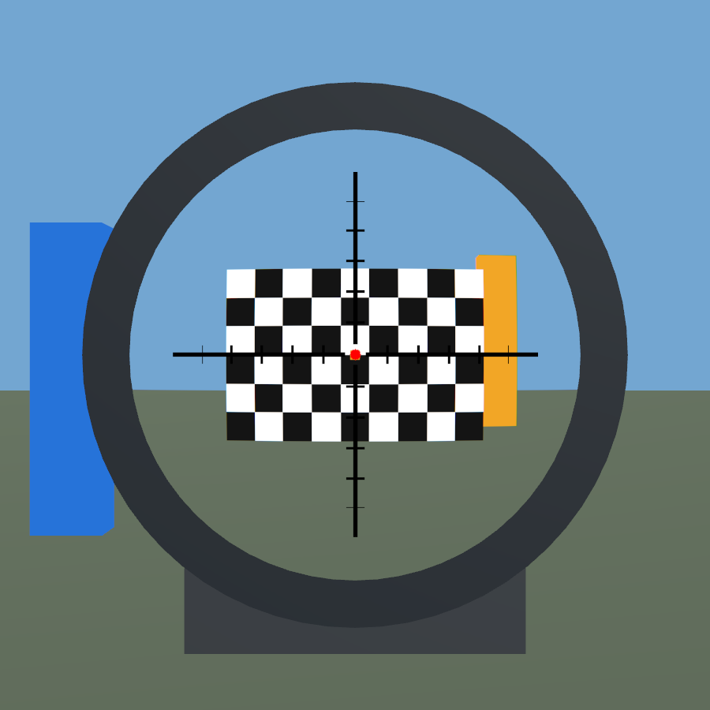
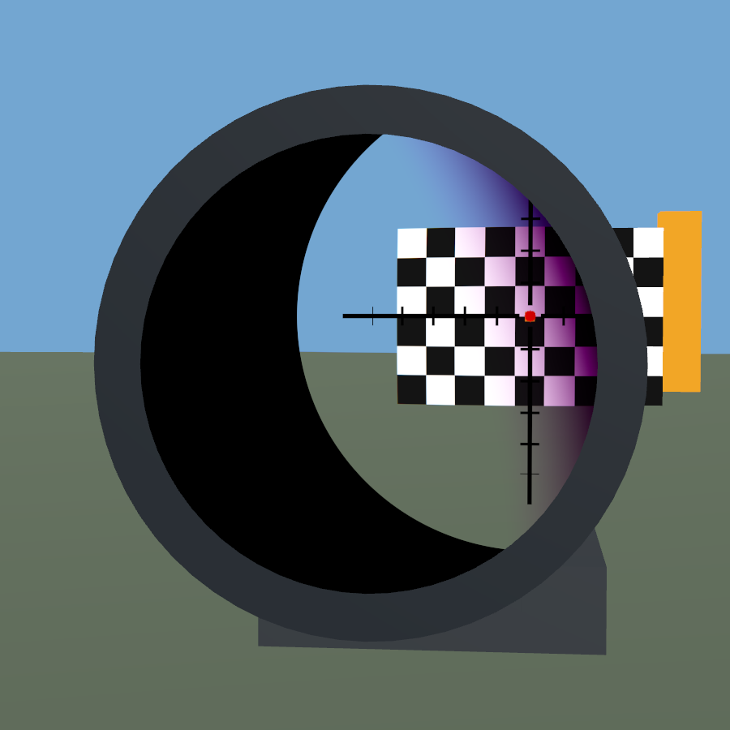

# AngularScope

> **AI disclaimer:** Code and documentation were developed with generative AI, human review, and iterative Unity/VR testing. This is an optical approximation; test it in your own setup.

A configurable optical-view shader and a standalone Unity example for scope creators. Includes variable magnification, SFP/FFP reticles, independent main/illumination layers, optional central reticle detail, a sharp field stop, a moving soft eye-box shadow, and optional lens distortion and chromatic aberration.

Built for Unity's **Built-in Render Pipeline on PC**, tested in Unity 2022.3.22f1.

## Try it

1. Download [AngularScope with the example](dist/AngularScope_WithExample.unitypackage) and import it into a Built-in RP Unity project.
2. Open `Assets/AngularScope/Examples/Scenes/AngularScopeDemo.unity` and enter Play mode.
3. Use the on-screen controls to compare magnification, focal planes, lens character, HDR and 4x MSAA. Move the eye with A/D, W/S and Q/E; R resets the view and V shows the model.

For the shader, documentation and editor-only setup, lens conversion and mask tools,
download [the smaller shader-only package](dist/AngularScope_ShaderOnly.unitypackage).
It contains no example models, textures, cameras or animation assets.

The lens material inspector groups scene/zoom, reticle, illumination, field/eyebox,
lens character and advanced calibration into collapsible sections. Start with
**Tools > AngularScope > Scope Setup** for calibration; use the material inspector
for direct fine-tuning. It does not automatically update camera FOV or zoom clips.

The shader **requires a separate camera and RenderTexture**. **PC VRChat avatars can use it, not just worlds.** For avatars, use the included animation-driven rig instead of the scripted demo; it supplies endpoint clips and a continuous zoom curve, not an automatic installer. Follow the [avatar integration guide](Assets/AngularScope/Documentation/AvatarIntegration.md).

The optical display must be a **rigid MeshRenderer**, optionally attached to a
weapon bone. The housing/covers can remain skinned. An editor conversion tool
is included for single-bone skinned lenses; optical animation bindings must be
updated after conversion. See the [lens setup guide](Assets/AngularScope/Documentation/README.md#local-coordinate-calibration-and-diagnostics).

## Magnification and focal plane

These are actual captures of the included procedural example, not illustrations. SFP keeps the reticle's apparent size fixed while the scene zooms. FFP scales the reticle together with the scene; both meet at the configured reference magnification of 6x.

| | 1x | 6x |
|---|---|---|
| SFP |  |  |
| FFP (reference = 6) |  |  |

**FFP reference = 6:** relative size is `magnification / reference`: one-sixth SFP at 1x, equal at 6x. The two 6x images intentionally match; FFP scaling remains active.

To match SFP size at 1x instead, set `_ReticleRefMagnification = 1`; the FFP reticle will then be six times that size at 6x, so outer marks may extend beyond the visible field. Choose the reference and reticle size together for your design. See the [reticle and illumination guide](Assets/AngularScope/Documentation/README.md#reticle-and-illumination-overlay).

### Alternative FFP reference: 1x

Only the reference changes to `1` below: reticle and camera settings are unchanged. At 1x it matches SFP; at 6x both layers are six times larger and outer marks are cropped. The example defaults to reference `6`.

| | 1x | 6x |
|---|---|---|
| FFP (reference = 1) |  |  |

The black etched cross and red illuminated centre are independent texture layers.

Advanced users can optionally replace a central portion of the main reticle
with a matching higher-density crop, sharing its focal plane and distortion.
It replaces that region at every zoom; it is not a texture swap at a zoom threshold.
Detail inherits the main layer's settings, rather than adding another independent
focal plane. This option defaults off. See
[central reticle detail](Assets/AngularScope/Documentation/README.md#optional-central-reticle-detail)
for crop coordinates, memory estimates and seam checks.

Monochrome art can use AlphaMask or a lightweight linear RedMask (BC4), independently
for each layer. The included editor conversion tool preserves original PNG dimensions,
including 4K, without altering the source. A 4K BC4 main mask plus a cropped 512 centre
mask uses about 10.84 MiB of GPU texture storage. Normal coloured RGBA art still works.
See [mask modes and conversion](Assets/AngularScope/Documentation/README.md#texture-modes-and-lightweight-4k-masks).

## Field stop and eye-box shadow

Two independent masks shape the view:

- **Sharp field stop:** a crisp circular boundary limits the apparent angular field. Moving the eye closer makes this boundary visible inside the housing; it is not another physical lens rim.
- **Soft eye-box shadow:** moving the eye sideways or vertically causes a soft shadow to sweep across the view. Moving too far behind the intended eye relief can also narrow the usable view.

| Sharp field stop | Soft eye-box shadow |
|---|---|
|  |  |

Both 1x captures keep both masks enabled. Left: on axis at 9cm. Right: 12cm away, offset 7mm horizontally and vertically. The housing supplies the physical boundary. Exit-pupil size may follow zoom or remain fixed for a forgiving view; this affects the soft shadow, not the field stop.

Optional **Near-eye lateral sensitivity** makes sideways/up-down movement less
forgiving when closer than eye relief minus axial tolerance, without adding
centred near-distance narrowing. It defaults to 0; try 1 and test your own rig.
This is an empirical comfort control, not measured real-scope behaviour. See
[near-eye tuning](Assets/AngularScope/Documentation/README.md#optional-near-eye-lateral-sensitivity).

## Lens distortion and chromatic aberration

Optional lens character adds adjustable visual imperfections to the optical view.
New materials have zero effect strengths. The Example starts with effects off;
its **Lens character** toggle enables a mild runtime comparison preset.

- **Radial distortion:** independently tune low/high-zoom coefficients for subtle
  barrel or pincushion character. Scene and reticle can share the distorted view;
  the field stop and eye-box geometry stay independent.
- **Scene colour fringe:** subtle radial R/B separation, concentrated near the edge.
- **Eye-box colour fringe:** warm or purple edging on the moving pupil shadow.
  These palettes are artistic choices, not measured lens prescriptions.

Use the same `AngularScopeDemo.unity` scene as above.
In Play mode, compare **Lens character** on/off and **Purple shadow fringe** on/off.
The mild example uses distortion +0.04 / -0.005 at 1x / 6x, scene fringe 0.004,
and shadow fringe 0.012. Camera-coverage checks warn about edge clipping; changing
coverage also requires matching camera FOV and zoom animations.

| Effects off | Mild lens character |
|---|---|
|  |  |

| Warm shadow fringe | Purple shadow fringe |
|---|---|
|  |  |

Actual Example captures at 1x, with a fixed exit pupil. The palette comparison
uses the same eye offset (13.5mm horizontally, 4mm vertically) and strength 0.012.
The mild preset is intentionally subtle, especially with the eye centred.

These are visual approximations, not a full physical lens simulation.
Enabled scene fringe adds two texture lookups; no extra camera is created.
See the [lens-character setup guide](Assets/AngularScope/Documentation/ScopeSetup.md#optional-lens-character).

## Included example

The scope housing, mount, checkerboard range, meshes and reticle textures are generated specifically for this example. No purchased scope or firearm assets are included.

Lens character, HDR and 4x MSAA start disabled. All comparisons use temporary
material/render-texture copies and restore the source settings on exit.
The demo supplies no central-detail texture or on-screen near-eye control;
configure those in a copied lens material before entering Play mode. See the
[example's advanced options](Assets/AngularScope/Examples/README.md#advanced-material-options).
HDR preserves bright scene values; MSAA smooths geometry edges, not reticle-texture
aliasing. Neither enables a post-processing stack automatically. See
[example controls](Assets/AngularScope/Examples/README.md) and
[render-texture quality](Assets/AngularScope/Documentation/README.md#optional-rendertexture-quality-settings).

## Documentation

- [Scope Setup: specifications, comfort controls and zoom authoring](Assets/AngularScope/Documentation/ScopeSetup.md)
- [Shader setup and parameter guide](Assets/AngularScope/Documentation/README.md)
- [Example controls and regeneration](Assets/AngularScope/Examples/README.md)
- [PC VRChat avatar integration and animation fixtures](Assets/AngularScope/Documentation/AvatarIntegration.md)

Quest avatar custom shaders, URP and HDRP are not supported by this package.
A single mono scene texture cannot reproduce exact near-field binocular parallax.

## License

The independently authored shader, scripts, documentation, example meshes and textures are dedicated under **CC0-1.0**. See [the full dedication](LICENSE) and [scope and third-party notices](NOTICE.md). Unity and third-party components remain subject to their own terms.
