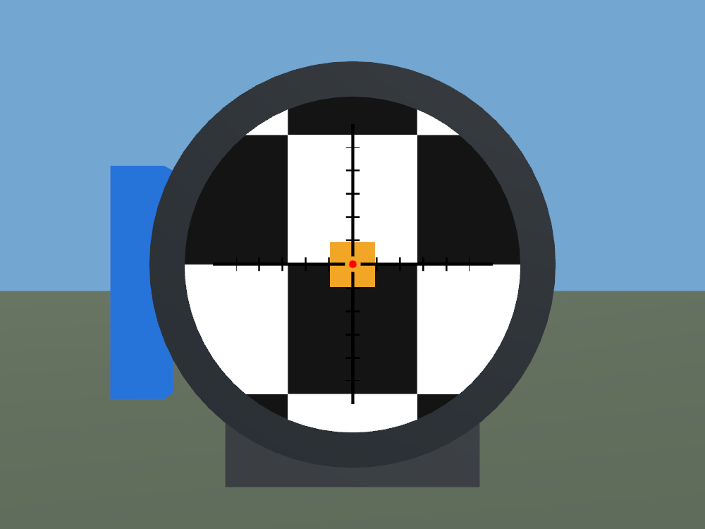
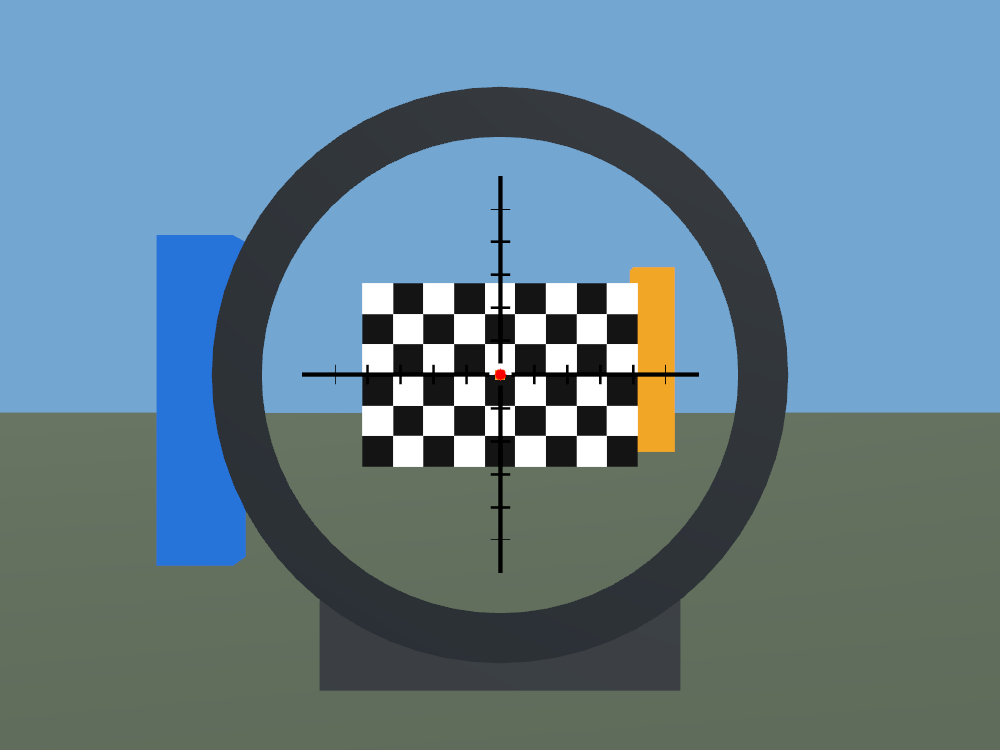
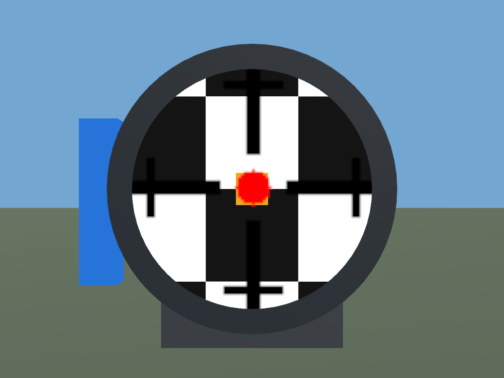
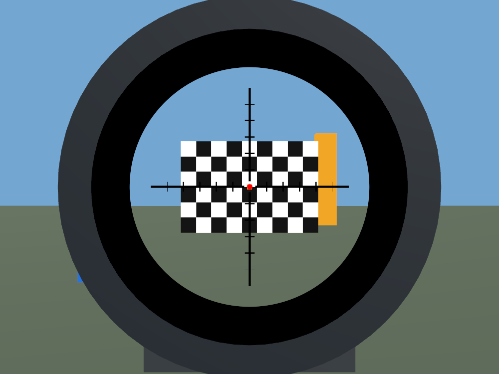
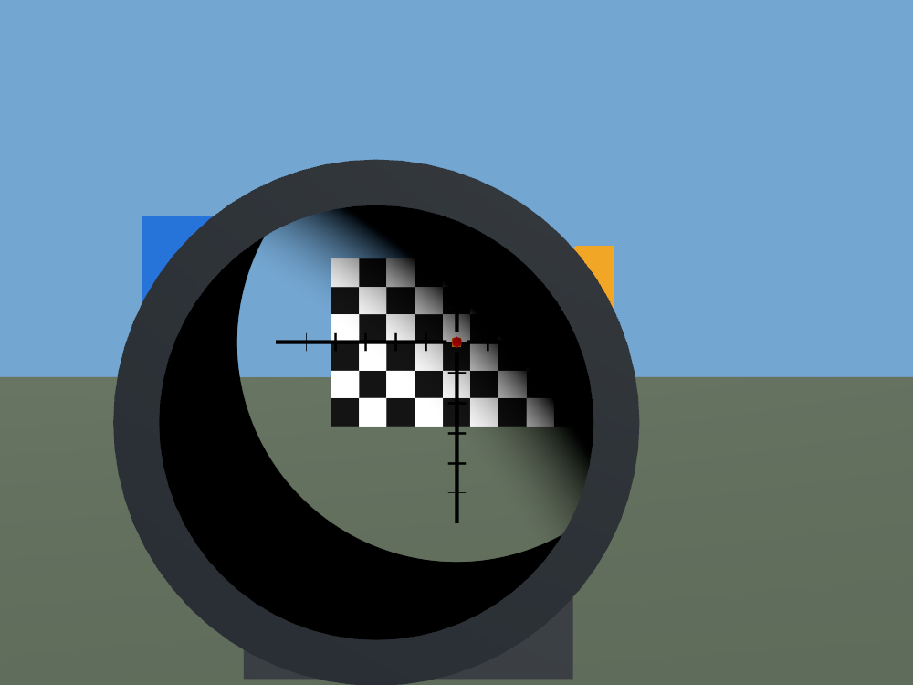
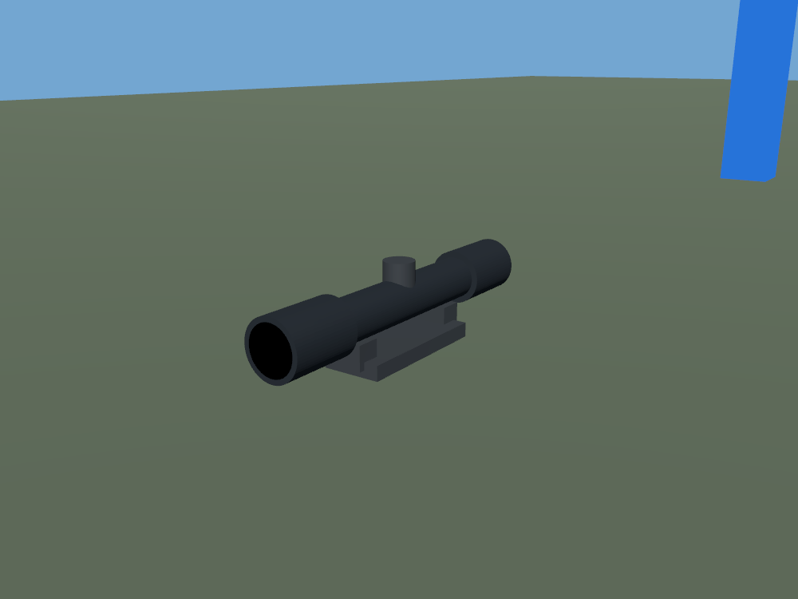

# AngularScope

> **AI disclaimer:** Code and documentation were developed with generative AI, human review, and iterative Unity/VR testing. This is an optical approximation; test it in your own setup.

A configurable optical-view shader and a standalone Unity example for scope creators. Includes variable magnification, SFP/FFP reticles, two independent reticle layers, a sharp field stop, and a moving soft eye-box shadow.

Built for Unity's **Built-in Render Pipeline on PC**, tested in Unity 2022.3.22f1.

## Try it

1. Download [AngularScope with the example](dist/AngularScope_WithExample.unitypackage) and import it into a Built-in RP Unity project.
2. Open `Assets/AngularScope/Examples/Scenes/AngularScopeDemo.unity` and enter Play mode.
3. Use the on-screen magnification and focal-plane controls. Move the eye with A/D, W/S and Q/E; R resets the view and V shows the model.

For the shader, documentation and optional editor-only lens conversion tool,
download [the smaller shader-only package](dist/AngularScope_ShaderOnly.unitypackage).
It contains no example models, textures, cameras or animation assets.

The shader **requires a separate camera and RenderTexture**. **PC VRChat avatars can use it, not just worlds.** For avatars, use the included animation-driven rig instead of the scripted demo; it supplies endpoint clips and a continuous zoom curve, not an automatic installer. Follow the [avatar integration guide](Assets/AngularScope/Documentation/AvatarIntegration.md).

The optical display must be a **rigid MeshRenderer**, optionally attached to a
weapon bone. The housing/covers can remain skinned. An editor conversion tool
is included for single-bone skinned lenses; optical animation bindings must be
updated after conversion. See the [lens setup guide](Assets/AngularScope/Documentation/README.md#local-coordinate-calibration-and-diagnostics).

**Updating to v0.3.0:** if your optical display is skinned, convert only the
lens to a rigid MeshRenderer, recalibrate its local centre and distances, and
rebind optical/visibility animations before uploading. Existing rigid lenses
do not need conversion. [Release notes](https://github.com/Zenukain/AngularScope/releases/tag/v0.3.0)
describe the change and validation scope.

## Magnification and focal plane

These are actual captures of the included procedural example, not illustrations. SFP keeps the reticle's apparent size fixed while the scene zooms. FFP scales the reticle together with the scene; both meet at the configured reference magnification of 6x.

| | 1x | 6x |
|---|---|---|
| SFP |  |  |
| FFP (reference = 6) |  |  |

**FFP reference = 6:** relative size is `magnification / reference`: one-sixth SFP at 1x, equal at 6x. The two 6x images intentionally match; FFP scaling remains active.

To match SFP size at 1x instead, set `_ReticleRefMagnification = 1`; the FFP reticle will then be six times that size at 6x, so outer marks may extend beyond the visible field. Choose the reference and reticle size together for your design. See the [reticle and illumination guide](Assets/AngularScope/Documentation/README.md#reticle-and-illumination-overlay).

### Alternative FFP reference: 1x

Only the reference changes to `1` below: reticle and camera settings are unchanged. At 1x it matches SFP; at 6x both layers are six times larger and outer marks are cropped. The example defaults to reference `6`.

| | 1x | 6x |
|---|---|---|
| FFP (reference = 1) |  |  |

The black etched cross and red illuminated centre are independent texture layers.

## Field stop and eye-box shadow

Two independent masks shape the view:

- **Sharp field stop:** a crisp circular boundary limits the apparent angular field. Moving the eye closer makes this boundary visible inside the housing; it is not another physical lens rim.
- **Soft eye-box shadow:** moving the eye sideways or vertically causes a soft shadow to sweep across the view. Moving too far behind the intended eye relief can also narrow the usable view.

| Sharp field stop | Soft eye-box shadow |
|---|---|
|  |  |

Both 1x captures keep both masks enabled. Left: on axis at 9cm. Right: 12cm away, offset 7mm horizontally and vertically. The housing supplies the physical boundary. Exit-pupil size may follow zoom or remain fixed for a forgiving view; this affects the soft shadow, not the field stop.

## Included example

The scope housing, mount, checkerboard range, meshes and reticle textures are generated specifically for this example. No purchased scope or firearm assets are included.

## Documentation

- [Shader setup and parameter guide](Assets/AngularScope/Documentation/README.md)
- [Example controls and regeneration](Assets/AngularScope/Examples/README.md)
- [PC VRChat avatar integration and animation fixtures](Assets/AngularScope/Documentation/AvatarIntegration.md)

No lens distortion or chromatic aberration is implemented. Quest avatar custom shaders, URP and HDRP are not supported by this package. A single mono scene texture cannot reproduce exact near-field binocular parallax.

## License

The independently authored shader, scripts, documentation, example meshes and textures are dedicated under **CC0-1.0**. See [LICENSE.md](LICENSE.md) and [the full dedication](CC0-1.0.txt). Unity and third-party components remain subject to their own terms.

